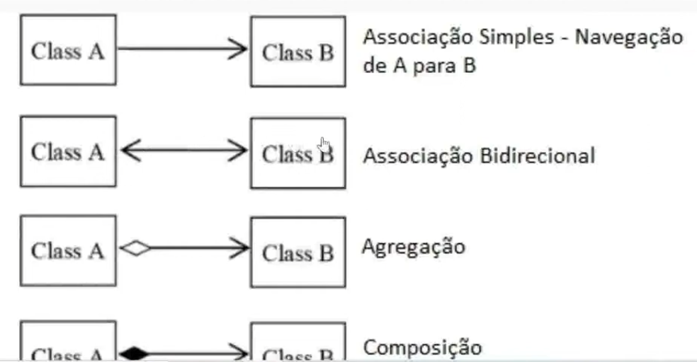

# UML

Linguagem de Modelagem Unificada ou UML(Unified Modeling Language) é uma notação que possibilita a representação gráfica de projeto.

Na UML temos três conceitos necessários para compreendermos inicialmente:

### diagramas, elementos e relacionamentos.

As notações UML são distribuídas em duas categorias de diagramas, a estrutural e comportamental conforme listagem abaixo:

## Diagramas Estruturais

- Diagrama de classe: O Diagrama de Classes é utilizado para fazer a representação de estruturas de classes de negócio, interfaces e outros componentes do sistema. Por esta característica, este diagrama é considerado o mais importante para a UML, pois auxilia a maioria dos demais diagramas.

- Diagrama de objetos: Este diagrama representa os objetos existentes em um determinado instante ou fato na aplicação. Assim conseguimos ter uma perspectiva do estado de nossos objetos mediante a interação dos usuários no sistema.

### Existem outras categorias de diagramas estruturais e comportamentais, porém iremos focar nos citados acima.

## Diagrama de Classe

O diagrama de classes ilustra "graficamente" como classes serão estruturadas e interligadas entre si diante da proposta do nosso software.

Em diagrama a estrutura das classes é constituída por:

- Identificação: Nome e/ou finalidade da classe;

- Atributos: Propriedades e/ou características;

- Operações: Ações e/ou métodos.

## Relacionamentos

Em um diagrama as classes podem existir de forma independente, mas obviamente haverá em alguma etapa da aplicação e necessidade de algumas se relacionarem, o que devemos compreender é o nível de dependência entre elas:

### Associação

Uma associação define um relacionamento entre duas classes, permitindo que um objeto tenha acesso a estrutura de um outro objeto.

### Agregação:

Em uma agregação a classe principal contém uma relação com outra classe mas ela pode existir sem a classe agragadora. Imagina em um cadastro de "Candidatos", podemos encontrar candidatos que ainda não possuam uma "Profissão".

Candidato é classe principal e a Profissão a agregação

### Composição:

A compasição já caracteriza uma dependência existencial entre a classe principal e a classe associada. Imaginamos que uma "Admissão" só poderá existir contendo suas informações básicas e a composição do Candidato selecionado.

Admissão é a classe principal e Candidato compõe a Admissão

## Multiplicidade

Nem sempre o relacionamento entre as classes será de [um para um](), um determinado cenário poderá exigir multiplicidades específicas conforme opções abaixo:

- 1.  -> Representa uma associação [contendo um elemento]().

- \*. -> Representa uma associação [contendo uma lista de elementos]().

- 0..1 -> Representa uma associação [contendo zero ou um elemento]().

- 0..\* -> Representa uma associação [contendo zero ou uma lista de elementos]().

## Visibilidade

Os atributos e métodos de uma classe podem receber níveis de visibilidade, e na UML existem símbolos que representam cada um deles.

- (+) Visibilidade pública;

- (#) Visibilidade protegida (muita associada com herança)

- (-) Visibilidade privada

### Representação

## Ferramentas

Existem inúmeras ferramentas de diagramação tanto online, pagas e gratuitas.

